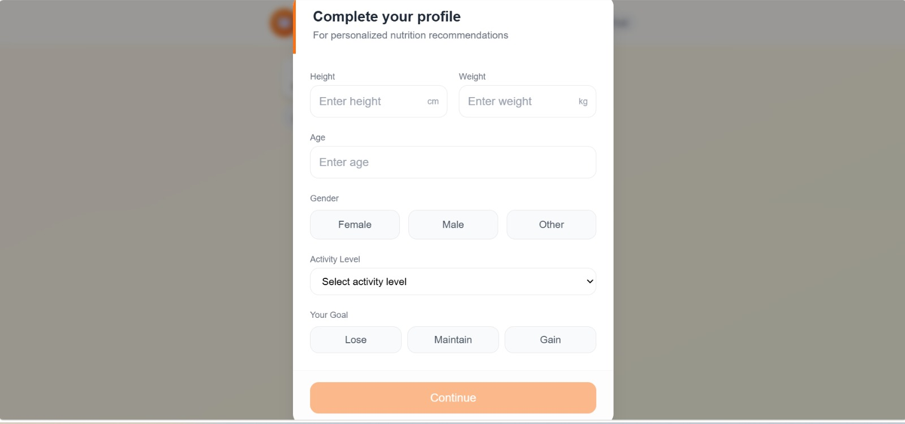

# 🥗 NutriValue – Smart Food Recognition & Nutrition Analysis Platform

NutriValue is a full-stack web application that allows users to analyze the nutritional value of their meals, track calorie intake, and manage personalized nutrition goals.

Users can upload or capture a food image, provide basic meal details, and receive estimated nutritional information including calories, protein, carbohydrates, and fats.

Built with **React, FastAPI, TensorFlow, Supabase, Tailwind CSS, and the USDA FoodData Central API**, NutriValue provides a simple and interactive nutrition tracking experience.

---

# 🚀 Features

## 🥗 For Users

- Upload food images or capture them using a webcam.
- AI-powered food recognition using TensorFlow.
- Supports:
  - Pizza 🍕
  - Burger 🍔
  - Samosa 🥟
  - Cheesecake 🍰
  - French Fries 🍟
  - Fried Rice 🍚
  - Ice Cream 🍦
- Answer meal-related questions such as food size for improved nutrition estimation.
- View calories, protein, carbohydrates, and fats.
- Track previous meals and calorie intake.

## 👤 Personalized Profile

- Create and manage a nutrition profile.
- Calculate daily calorie goals based on:
  - Height
  - Weight
  - Age
  - Gender
  - Activity Level
  - Fitness Goal

## 📊 Nutrition Dashboard

- View meal history.
- Track calorie intake.
- View weekly calorie trends.
- Monitor macronutrient distribution.

---

# 🌟 Highlights

- 🤖 TensorFlow-based food recognition.
- 📸 Food image upload and webcam capture.
- 🥗 Hybrid nutrition estimation using machine learning, user inputs, and USDA FoodData Central.
- 🎯 Personalized daily calorie goals.
- 📈 Nutrition tracking dashboard.
- 🔐 Secure authentication using Supabase.
- 💾 Meal history stored in Supabase PostgreSQL.

---

# 🛠️ Tech Stack

| LayerTechnology      |                                                  |
| -------------------- | ------------------------------------------------ |
| **Frontend**         | React 18, JavaScript, Tailwind CSS, React Webcam |
| **Backend**          | Python, FastAPI, Uvicorn                         |
| **Machine Learning** | TensorFlow, Keras, NumPy                         |
| **Database**         | Supabase PostgreSQL                              |
| **Authentication**   | Supabase Auth                                    |
| **Nutrition API**    | USDA FoodData Central API                        |
| **Image Processing** | Pillow (PIL)                                     |
| **Version Control**  | Git & GitHub                                     |

---

# 🖼️ Screenshots

## 👤 User Profile

Personalized nutrition profile and daily calorie goal.



---

## 🏠 Home Dashboard

Upload a food image or capture one using your webcam.

*(Add dashboard screenshot here)*

---

## 🔍 Meal Analysis

Answer meal-related questions to improve nutrition estimation.

*(Add meal analysis screenshot here)*

---

## 📊 Nutrition Results

View estimated calories, protein, carbohydrates, and fats.

*(Add nutrition results screenshot here)*

---

## 📈 Meal History

View previously analyzed meals and nutrition trends.

*(Add meal history screenshot here)*

---

# ⚡ Getting Started

## Prerequisites

- Python 3.13+
- Node.js 18+
- npm
- Git
- USDA FoodData Central API Key
- Supabase Project URL
- Supabase API Key

## Installation

### Clone the Repository

```
git clone https://github.com/gaurii0709/NutriValue-Smart-Food-Recognition-Nutrition-Analysis-Platform.git

cd NutriValue-Smart-Food-Recognition-Nutrition-Analysis-Platform

```

### Backend Setup

```
cd nutrivalue_backend

python -m venv venv

venv\Scripts\activate

pip install -r requirements.txt

```

Create a `.env` file inside `nutrivalue_backend`:

```
DEBUG=True
APP_NAME=NutriValue
PORT=8000
CORS_ORIGINS=http://localhost:3000,http://localhost:5173
USDA_API_KEY=YOUR_USDA_API_KEY
SUPABASE_URL=YOUR_SUPABASE_URL
SUPABASE_KEY=YOUR_SUPABASE_API_KEY

```

Run the backend:

```
uvicorn app.main:app --reload --port 8000

```

### Frontend Setup

Open a new terminal:

```
cd frontend_react

npm install

npm start

```

Open [**http://localhost:3000**](http://localhost:3000) to use the application.

---

# 🔮 Future Enhancements

- Support multiple food items in a single image.
- Automatic portion-size estimation.
- Barcode scanning for packaged foods.
- Personalized meal recommendations.
- Mobile application for Android and iOS.
- Integration with fitness trackers and wearable devices.

---

# 📌 License

This project is licensed under the **MIT License**.

## About

NutriValue is a full-stack food recognition and nutrition analysis platform built with **React, FastAPI, TensorFlow, and Supabase**. It combines food recognition, user-provided meal information, and USDA nutritional data to provide personalized nutrition estimates and calorie tracking.


this is final im using
